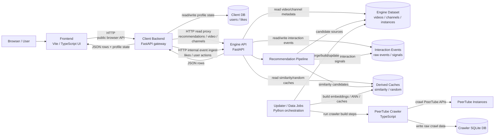
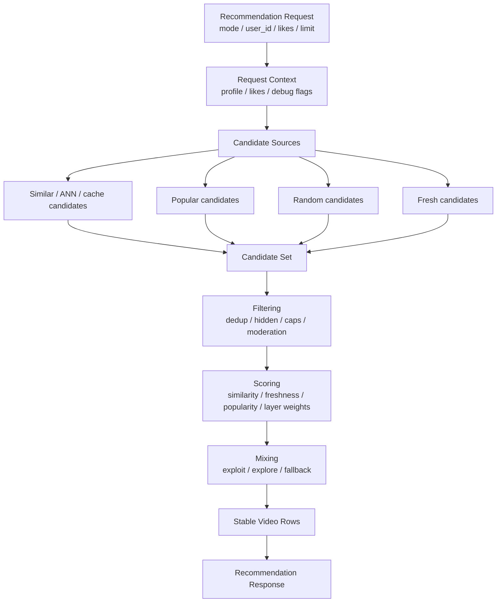
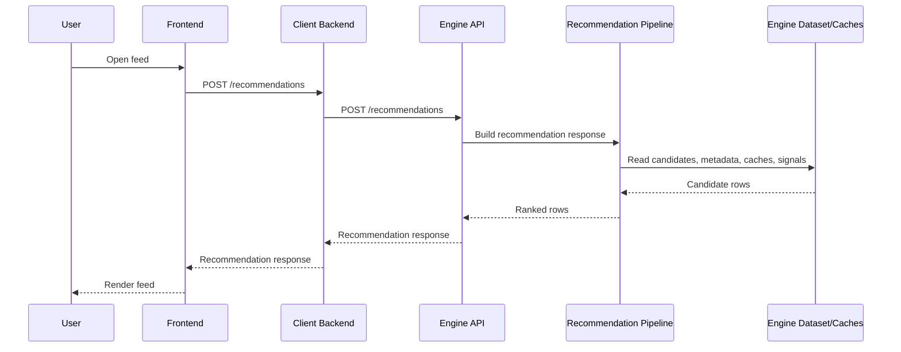
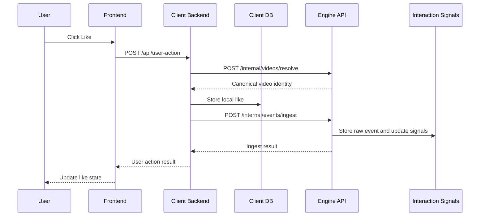
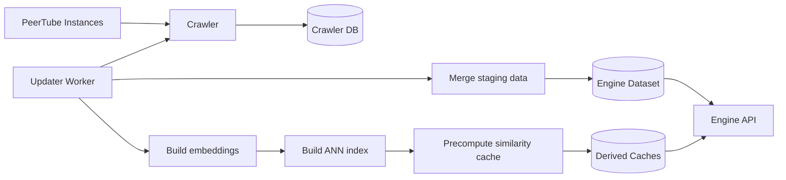

# Project Architecture Overview

This diagram shows the main runtime components, data owners, and update paths in PeerTube Browser. It is a high-level map of the whole project, not a detailed recommendation pipeline diagram.

For recommendation internals, see:

```text
engine/server/api/recommendations/docs/PIPELINE_DIAGRAM.md
```

## System overview



## Main responsibilities

### Frontend

The frontend owns browser UI behavior.

It is responsible for:

```text
rendering video feeds
rendering video pages
rendering channel pages
sending user actions to the Client backend
storing only browser-local UI state where needed
calling the Client backend, not the Engine directly
```

The frontend must not call Engine internal routes directly. The expected runtime path is:

```text
Frontend -> Client Backend -> Engine API
```

### Client Backend

The Client backend is the browser-facing API gateway.

It is responsible for:

```text
public API routes used by the frontend
local user profile state
local likes state
normalizing browser user actions
proxying read requests to the Engine API
publishing normalized interaction events to the Engine
```

It owns the Client DB:

```text
users
likes
```

It must not:

```text
read Engine SQLite databases directly
import Engine internals
compute recommendations
crawl PeerTube data
own Engine datasets or caches
```

### Engine API

The Engine API owns read-side product behavior.

It is responsible for:

```text
recommendation routes
video metadata routes
channel routes
internal video resolve/metadata routes
internal interaction event ingest
reading Engine datasets and derived caches
serving stable frontend-facing rows
```

It owns or reads:

```text
video/channel/instance datasets
interaction raw events
interaction signals
similarity caches
random caches
recommendation candidate sources
```

It must not:

```text
own frontend UI state
own Client user profile persistence
crawl PeerTube directly during request handling
change crawler schema ownership
```

### Recommendation Pipeline

The recommendation pipeline is part of the Engine API.

At a high level:



Detailed recommendation behavior belongs in:

```text
engine/server/api/recommendations/docs/PIPELINE_DIAGRAM.md
engine/server/api/recommendations/docs/OVERVIEW.md
engine/server/api/recommendations/docs/LAYER_PARAMS.md
```

### Crawler

The crawler owns PeerTube collection behavior.

It is responsible for:

```text
discovering instances
checking instance health
collecting channels
collecting videos
collecting tags/comments where supported
writing crawler-owned SQLite data
```

The crawler is TypeScript-based and uses:

```text
engine/crawler/src/*
engine/crawler/schema.sql
```

The crawler schema is owned by the crawler. Engine runtime migrations do not replace crawler schema ownership.

### Updater / Data Jobs

Updater jobs orchestrate offline data work.

They are responsible for:

```text
running crawler stages
building staging data
merging staging data into production datasets
building embeddings
building ANN indexes
precomputing similarity caches
recomputing popularity
handling updater locks and service restarts
```

The updater is operational orchestration. It should not own request-time API behavior.

### Databases and caches

The project has several separate data ownership areas:

```text
Client DB
  owner: Client backend
  purpose: users and local likes

Crawler DB
  owner: TypeScript crawler
  purpose: raw PeerTube crawl output

Engine dataset
  owner: Engine data/build process
  purpose: videos, channels, instances used by Engine API

Interaction tables
  owner: Engine API
  purpose: raw events and aggregate interaction signals

Derived caches
  owner: Engine jobs / Engine data layer
  purpose: similarity candidates, random feed cache, ANN-related outputs
```

## Request flows

### User opens the feed



### User likes a video



### Data update flow



## Dependency boundaries

These boundaries are intentional:

```text
Frontend may call Client backend HTTP routes.
Frontend must not call Engine internals directly.

Client backend may call Engine over HTTP.
Client backend must not import Engine modules or read Engine DB files directly.

Engine API may read Engine datasets, caches, and interaction tables.
Engine API must not own Client user profile persistence.

Crawler writes crawler-owned data.
Crawler does not serve frontend requests.

Updater/jobs orchestrate offline data-building work.
Updater/jobs do not own request-time API contracts.

Recommendation services are Engine-internal.
Recommendation services should remain framework-neutral where possible.
```

## What this diagram does not show

This overview intentionally does not show every module, function, or class.

It does not replace:

```text
engine/server/api/recommendations/docs/PIPELINE_DIAGRAM.md
docs/SCHEMA_OWNERSHIP.md
docs/FRAMEWORK_COMPATIBILITY.md
docs/UPDATER_COMPATIBILITY.md
docs/CRAWLER_COMPATIBILITY.md
docs/FRONTEND_COMPATIBILITY.md
```

Use this file as the high-level system map. Use the focused documents for detailed behavior and compatibility rules.
