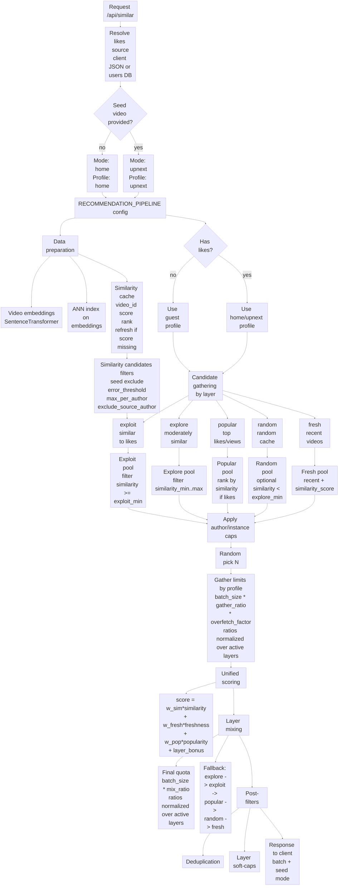

# Recommendation Delivery Pipeline Diagram

Below is a Mermaid diagram of the delivery pipeline, based on `server/api/recommendations/RECOMMENDATIONS_OVERVIEW.md`.

```mermaid
%%{init: {"flowchart": {"nodeSpacing": 50, "rankSpacing": 50}, "themeVariables": {"fontSize": "48px"}}}%%
flowchart TD
    A[Request /api/similar] --> A1[Resolve likes source<br/>client JSON or users DB]
    A1 --> B{Seed video provided?}
    B -- no --> C[Mode: home<br/>Profile: home]
    B -- yes --> D[Mode: upnext<br/>Profile: upnext]

    C --> E[RECOMMENDATION_PIPELINE config]
    D --> E

    E --> F[Data preparation]
    F --> F1[Video embeddings<br/>SentenceTransformer]
    F --> F2[ANN index on embeddings]
    F --> F3[Similarity cache<br/>video_id score rank<br/>refresh if score missing]

    E --> E0{Has likes?}
    E0 -- no --> E1[Use guest profile]
    E0 -- yes --> E2[Use home/upnext profile]

    E1 --> G[Candidate gathering by layer]
    E2 --> G
    G --> G1[exploit<br/>similar to likes]
    G --> G2[explore<br/>moderately similar]
    G --> G3[popular<br/>top likes/views]
    G --> G4[random<br/>random cache]
    G --> G5[fresh<br/>recent videos]

    G1 --> H1[Exploit pool<br/>filter similarity >= exploit_min]
    G2 --> H2[Explore pool<br/>filter similarity_min..max]
    G3 --> H3[Popular pool<br/>rank by similarity if likes]
    G4 --> H4[Random pool<br/>optional similarity < explore_min]
    G5 --> H5[Fresh pool<br/>recent + similarity_score]

    H1 --> Hcaps[Apply author/instance caps]
    H2 --> Hcaps
    H3 --> Hcaps
    H4 --> Hcaps
    H5 --> Hcaps

    Hcaps --> Hr[Random pick N]

    F3 --> S[Similarity candidates filters<br/>seed exclude<br/>error_threshold<br/>max_per_author<br/>exclude_source_author]
    S --> G1

    Hr --> I[Gather limits by profile<br/>batch_size * gather_ratio<br/>* overfetch_factor<br/>ratios normalized over active layers]

    I --> J[Unified scoring]
    J --> J1[score = w_sim*similarity<br/>+ w_fresh*freshness<br/>+ w_pop*popularity<br/>+ layer_bonus]

    J --> K[Layer mixing]
    K --> K1[Final quota<br/>batch_size * mix_ratio<br/>ratios normalized over active layers]
    K --> K2[Fallback: explore -> exploit -> popular -> random -> fresh]

    K --> L[Post-filters]
    L --> L1[Deduplication]
    L --> L2[Layer soft-caps]

    L --> M[Response to client<br/>batch + seed mode]

```
